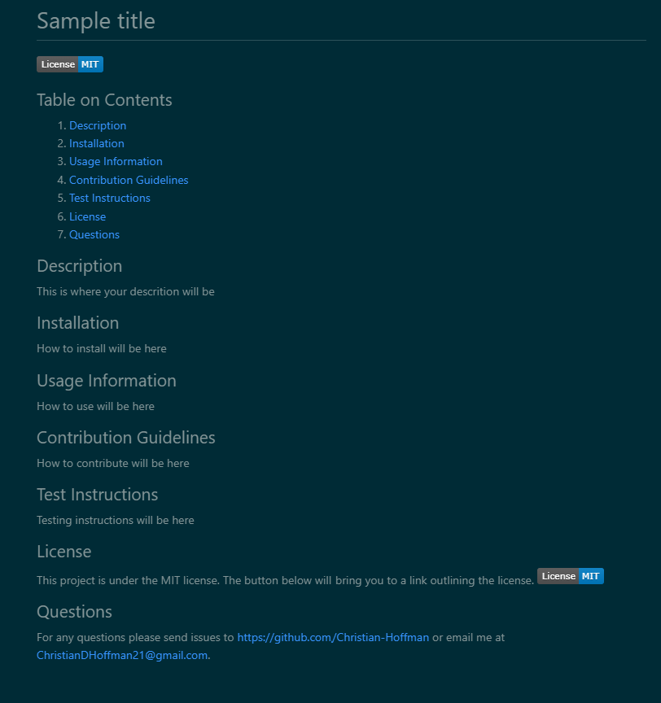

# Readme Generator

## Table of Contents
  1. [Description](#description)
  2. [Installation](#installation)
  3. [Usage Information](#usage-information)
  4. [Contribution Guidelines](#contribution-guidelines)
  5. [Test Instructions](#test-instructions)
  6. [License](#license)
  7. [Questions](#questions)
  8. [Visuals](#visuals)

  ## Description
This project is a script that allows a user to generate a README.md file for their own projects
  ## Installation
Save the generate.js file in your own directory for your project. \
In your terminal run npm init\
then run npm install inquirer@8.2.4
  ## Usage Information
In the directory that you saved the generate.js file\
in the terminal, run node generate.js\
When all prompts are completed, a README.md will be generated in that directory
  ## Contribution Guidelines
For contributions, either send in a issue or contact me at the links below
  ## Test Instructions
N/A
  ## License
N/A
  ## Questions
[GitHub](https://GitHub.com/Christian-Hoffman) \
[ChristianDHoffman21@gmail.com](mailto:ChristianDHoffman21@gmail.com)

  ## Visuals
[Link to video walkthrough](https://drive.google.com/file/d/1j6pYf9zHQDqo5PgufS10m3EQCoapYTBh/view)
